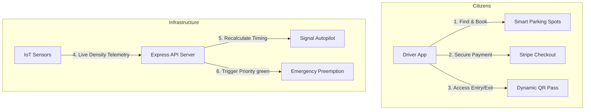

# 🏙️ TraffiTech: Smart Traffic & Parking Management System
### *End-to-End Project Description & Technical Documentation*

---

## 📌 Executive Summary
**TraffiTech** is a Progressive Web Application (PWA) designed to address two of the most critical challenges facing modern urban areas: **traffic congestion** and **inefficient parking space allocation**. 

By combining real-time IoT sensor telemetry, interactive map visualizations (React-Leaflet), automated Stripe payment processing, and dynamic demand-based pricing, TraffiTech creates a unified ecosystem for citizens and city administrators. It streamlines the parking space discovery process, dynamically controls traffic light cycles based on vehicle density, and provides critical safety features like real-time emergency routing overrides.

---

## ⚠️ The Problem Statement
As urban populations grow, legacy traffic control and parking infrastructures fail to scale:
1.  **Inefficient Parking Search:** Studies show that drivers searching for parking account for up to **30% of urban traffic congestion**, resulting in wasted fuel, higher carbon emissions, and driver frustration.
2.  **Static Traffic Signal Timing:** Conventional traffic lights operate on fixed, pre-programmed timers that do not adjust to actual traffic flow, leading to unnecessary idling and gridlocks during peak hours.
3.  **Emergency Vehicle Delays:** First responders (ambulances, fire engines) face critical delays navigating gridlocked intersections, which can directly affect patient survival rates.
4.  **Siloed Infrastructure:** Existing parking and traffic tracking systems operate independently, preventing city planners from making data-driven decisions.

---

## 💡 The Solution: TraffiTech
TraffiTech bridges these silos by integrating real-time traffic signal automation and reservation-based parking into a single, responsive platform.

---

## 🛠️ Core Features & Detailed Workflows

### 🚦 1. Adaptive Traffic Control Center
*   **Emergency Corridor Override (SOS):** Allows dispatcher networks or EMT responders to trigger a global emergency override. The system immediately forces the required vertical or horizontal route into a continuous green light sequence, clearing traffic blocks before the vehicle arrives.
*   **AI-Powered Autopilot Mode:** Evaluates live density readings from simulated IoT sensors and dynamically adjusts cycle durations. Lanes with high vehicle density are prioritized, while empty corridors receive shorter green windows, keeping traffic flowing continuously.
*   **Live Simulation Map:** An interactive, responsive crossroads schematic mapping active signals, current speeds, and active vehicle counters.

### 🅿️ 2. Smart Parking Space Allocation
*   **Interactive Geolocation Spotting:** Integrates React-Leaflet maps to automatically capture the user's GPS coordinates and display nearby parking garages.
*   **Dynamic Surge Pricing:** Features demand-responsive pricing logic. During peak hours (9:00–11:00 AM & 5:00–7:00 PM), the hourly parking rate scales by **1.5x** automatically to manage parking gridlocks.
*   **Seamless Reservation Flow:** Built with Stripe Elements. Users securely enter checkout credentials, receive automated session confirmations, and generate a dynamic, digital **QR Access Ticket** for contactless gate verification.

### 📊 3. Executive Data Insights
*   **System Analytics:** Features custom-styled **Recharts** line charts showing traffic volume trends mapped against hourly parking occupancy over 24 hours.
*   **Revenue & Space Management:** Displays cumulative revenue, total transactions, and fills/availabilities per parking zone (Week, Month, Year views).

---

## 💻 Tech Stack & Architecture

*   **Frontend (Single Page App):** React 19, Vite, Tailwind CSS, Leaflet, Recharts, Lucide Icons, Framer Motion.
*   **Backend (REST API & WebSockets):** Node.js, Express, Socket.io (for streaming real-time IoT signal cycles).
*   **Database (Hybrid Storage Model):** MongoDB Atlas (Cloud database) backed by a Zero-Dependency local JSON file database fallback for maximum reliability.
*   **Payment Gateway:** Stripe API integration.
*   **Hosting & Production:** Frontend hosted on **Vercel**, Backend hosted on **Render** (fully hosted in the cloud, running 24/7).

---

## 🌟 Why TraffiTech is Different
1.  **Unified Ecosystem:** Instead of using separate apps for traffic navigation and parking booking, TraffiTech joins them together to help drivers park before hitting gridlocks.
2.  **Offline Resilience:** The application's database adapter automatically fails over to local files if cloud servers are unreachable, guaranteeing zero downtime.
3.  **Progressive Web App (PWA) First:** Fully installable directly onto mobile home screens without requiring native app store downloads.

---

## 📈 Future Scope & Large-Scale Optimizations
Based on the physical and digital systems optimization domain, we have designed a roadmap detailing three large-scale features:

1. **🚚 Freight & Logistics Priority Routing (Supply Chain)**
   * **Concept:** Integration with registered delivery truck fleets (e.g., Amazon, FedEx). The system recognizes these logistics vehicles on approaching corridors and coordinates the traffic grid to provide "Priority Green" windows.
   * **Impact:** Drastically reduces delivery delay overhead, lowers idling fuel waste, and optimizes supply chain flow inside heavy commercial zones.
   
2. **💡 IoT-Based Smart Streetlighting (Infrastructure Energy Management)**
   * **Concept:** Linking physical city streetlighting grids directly to TraffiTech's traffic density sensors. When zero traffic is detected during off-peak night hours, streetlights dim by 50% automatically and ramp back to 100% brightness as vehicles approach.
   * **Impact:** Slashes city energy costs and grid loads by up to 40% while keeping roads safely lit.

3. **📐 Urban Planning Simulator (Virtual Layout Builder)**
   * **Concept:** A sandbox simulation mode built into the admin control panel. It allows traffic engineers to test route redesigns (e.g., adding roundabouts or modifying parking garages) against historical volume trends.
   * **Impact:** Enables predictive urban planning before spending capital resources on physical roadway redesign.

---

## 🚀 Live Access Links
*   **Live Application URL:** [https://trafitech-git-main-10-mohans-projects.vercel.app/](https://trafitech-git-main-10-mohans-projects.vercel.app/)
*   **GitHub Code Repository:** [https://github.com/10-Mohan/Trafitech](https://github.com/10-Mohan/Trafitech)
