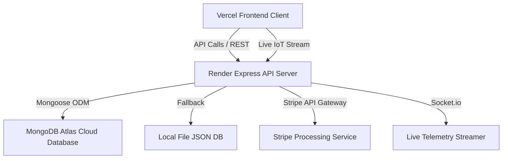

# 🏙️ TraffiTech: Smart Traffic & Parking Management System

[](https://vite.dev/)
[](https://react.dev/)
[](https://tailwindcss.com/)
[](https://nodejs.org/)
[](https://www.mongodb.com/)
[](https://stripe.com/)
[](https://socket.io/)
[](https://vercel.com/)

TraffiTech is an end-to-end, AI-powered Progressive Web Application (PWA) designed to optimize urban mobility, streamline traffic flow, and automate parking space allocation. Equipped with live IoT telemetry simulation, interactive geolocation maps, and integrated payments, it provides a comprehensive dashboard for administrators and citizens alike.

---

## 🎯 Key Features

### 🚥 1. Traffic Control Center
* **Active Corridor Preemption:** One-click emergency corridor override to clear lanes for EMTs/ambulances.
* **Auto-Pilot Mode:** AI-driven cycle recommendations that adjust traffic light durations dynamically based on vehicle density.
* **Live Intersection Map:** Interactive SVG visualization of road intersections with active car flow animations.

### 🚗 2. Smart Parking Allocation
* **Interactive Geolocation Map:** Real-time user localization with automatic discovery of nearby parking zones via Leaflet.
* **Dynamic Surge Pricing:** Automatic price adjustments (1.5x multiplier) during high-demand peak hours.
* **Integrated Booking & Payments:** Secure reservation of selected slots backed by Stripe API test payments.
* **Digital Access Tickets:** Generates dynamic, secure QR codes for automated entry and exit authentication.

### 📊 3. Executive Analytics Dashboards
* **System Analytics:** Interactive Recharts trendlines measuring traffic density vs. parking availability over 24 hours.
* **Parking Analytics:** Real-time occupancy breakdown (Available, Occupied, Reserved) and revenue projections categorized by date ranges (week, month, year).

### 📱 4. Progressive Web App (PWA) Support
* Fully responsive UI optimized for mobile viewports, landscape tablets, and desktop setups.
* Offline capability and quick launch access via home screen installation.

---

## 🏗️ Architecture



---

## 💻 Local Setup & Development

### Prerequisites
* [Node.js](https://nodejs.org/) (v16+)
* npm (v8+)

### 1. Clone & Install Dependencies
```bash
# Clone the repository
git clone https://github.com/10-Mohan/Trafitech.git
cd Trafitech

# Install Frontend dependencies (Root directory)
npm install

# Install Backend dependencies
cd server
npm install
```

### 2. Configure Environment Variables
Create a `.env` file inside the `server/` directory:
```env
PORT=5000
MONGODB_URI=mongodb://localhost:27017/traffitech
JWT_SECRET=your_super_secret_jwt_key
NODE_ENV=development
STRIPE_SECRET_KEY=your_stripe_sk_test_key
```

### 3. Run Locally
```bash
# Start the Backend Server (from server/ directory)
npm run dev

# Start the Frontend Vite Client (from root directory in a new terminal)
npm run dev
```
Open [http://localhost:5173](http://localhost:5173) in your browser.

---

## 🚀 Cloud Production Deployment

The project is fully set up for 24/7 cloud availability without requiring your local laptop to run:

### 1. Database (MongoDB Atlas)
* Spin up a free cluster on MongoDB Atlas.
* Set IP Access list to `0.0.0.0/0` (Allow access from anywhere).
* Copy your connection string and insert your user credentials.

### 2. Backend (Render.com)
* Create a new Web Service pointing to your repository.
* Set the Root Directory to `server`.
* Set Build Command to `npm install` and Start Command to `node index.js`.
* Input your `MONGODB_URI`, `JWT_SECRET`, and Stripe keys as environment variables.

### 3. Frontend (Vercel.com)
* Connect your repository to Vercel.
* Set the Build Command to `npm run build` and Output Directory to `dist`.
* Add `VITE_API_URL` pointing to your Render service (`https://your-api.onrender.com/api`).
* Vercel will automatically trigger deployments on every git push to your `main` branch.

---

## 📜 License
This project is licensed under the MIT License.
